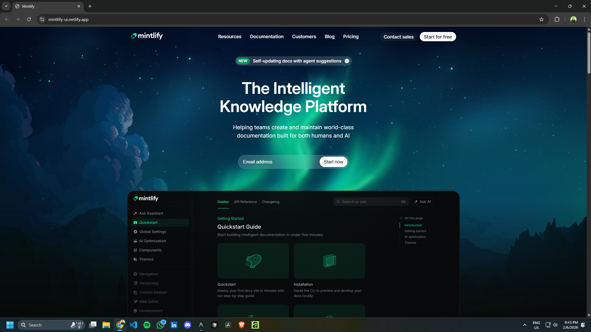
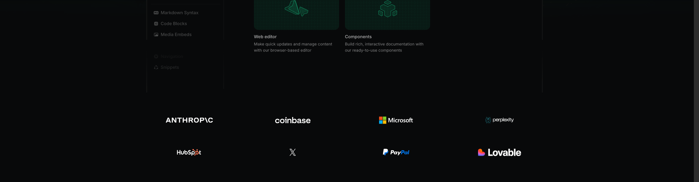
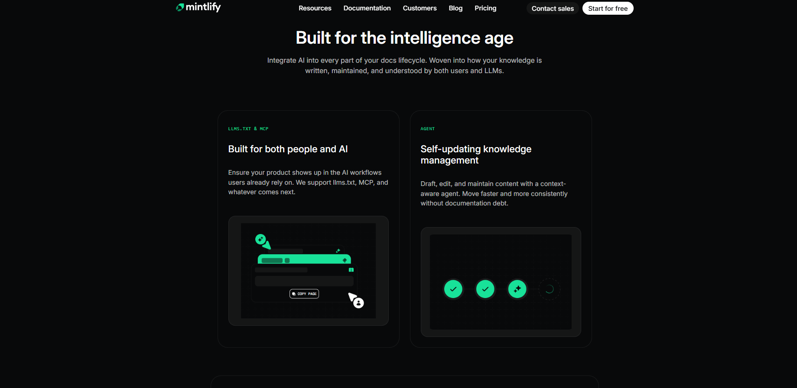
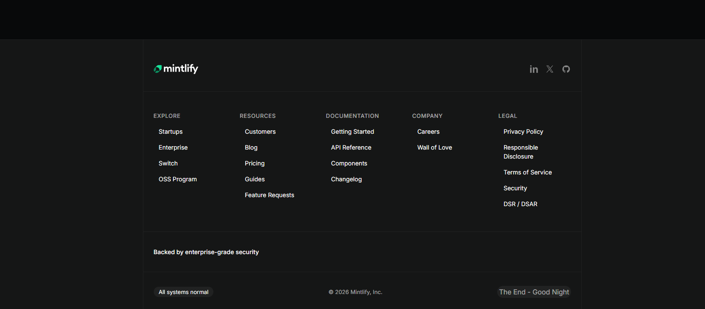

# Mintlify UI Clone

A recreation of the Mintlify homepage using pure HTML and CSS.

**Live Website**: [https://mintlify-ui.netlify.app/](https://mintlify-ui.netlify.app/)  
**GitHub Repository**: [https://github.com/dhirajdotdev/mintlify-ui-html-css](https://github.com/dhirajdotdev/mintlify-ui-html-css)

## Recreated Sections

The following sections from the original Mintlify website have been faithfully recreated:

1.  **Header & Navigation**: Responsive items with hover effects.
2.  **Hero Section**: Including the "New" capsule, main headline, email capture form, and hero image.
3.  **Logos Section**: A grid of client logos with hover/mask effects.
4.  **AI Section**: "Built for the intelligence age" with feature cards.
5.  **Enterprise Section**: Highlighting enterprise features and security.
6.  **Customers Section**: Showcasing customer success stories.
7.  **CTA Section**: Final "Get started" call to action with pricing and docs links.
8.  **Footer**: Comprehensive links and social media icons.

## Fonts and Colors

### Fonts
*   **Primary Font**: `Inter` (Variable font)
*   **Fallbacks**: `system-ui`, `-apple-system`, `BlinkMacSystemFont`, `Segoe UI`, `Roboto`, `sans-serif`.

### Color Palette
The design uses a modern dark theme implemented with modern CSS color spaces (`lab`).

*   **Background**: Dark Theme (`lab(2.4% -0.16 -0.47)`)
*   **Text**: White (`lab(100% 0 0)`)
*   **Brand Accent**: Mint Green (`lab(79.9% -59.6 22.5)`)
*   **Brand Light**: Lighter Green (`lab(51.3% -41.5 15.3)`)

## Screenshots

### Hero Section

### Logos & Social Proof

### Feature Cards

### Footer

